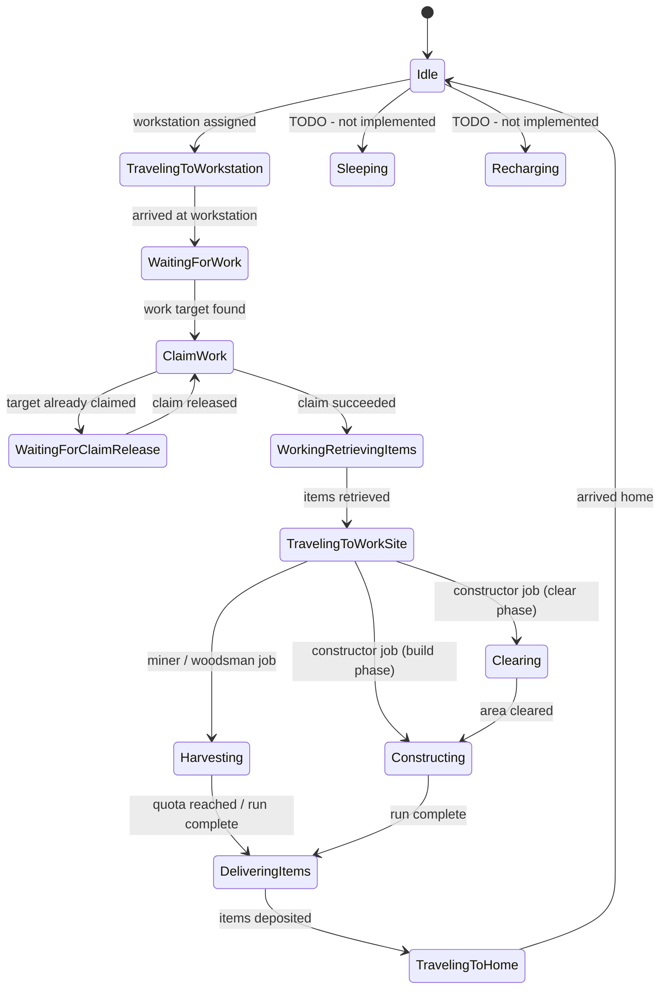

# HytaleColonies NPC Design

## Core principle

**ECS is the single source of truth for state and state-transition decisions.**
**JSON is the single source of truth for movement, animation, and predefined NPC actions while in a state.**

Each colonist has exactly one assigned job type. Multiple simultaneous roles per NPC are not supported -- assign a different NPC for each job.

These two concerns must not bleed into each other. ECS never issues a `BodyMotion`.
JSON never sets a `JobState` or decides when to transition between states.

---

## ECS / JSON contract

### ECS -> JSON (ECS writes, JSON reads)

| Channel | How |
|---|---|
| `JobComponent.jobState` | JSON gates all behavior on native `"Type": "State"` sensors (with `"IgnoreMissingSetState": true`) |
| Navigation target position | ECS writes a `MoveToTargetComponent`; `PathFindingSystem` forwards it to the entity's `MarkedEntitySupport` component (`getStoredPosition(0)`); JSON `ReadPosition(Slot=NavTarget)` + `Seek` drives movement |
| NPC leash point | ECS writes `NPCEntity.getLeashPoint()` via `ColonistLeashUtil`; JSON `WanderInCircle` constrains to it |

ECS sets the state, the destination, and the wander anchor. JSON drives the body.

### JSON -> ECS (JSON writes, ECS reads)

JSON surfaces consequential events upward via **notification flags** on job components.
These are `boolean` fields, default `false`, cleared by ECS after reading.

- Add one flag per distinct event type per job.
- The notification action only sets the flag to `true` -- no logic inside it.
- ECS decides what the event means.

---

## JobState enum

`JobState` is a single flat enum for codec serialization. The `group` field carries the
high-level phase (maps 1-to-1 with the NPC role main-state name). `npcSubState` is the
NPC role sub-state name (`null` = use the group name as the sub-state).

```java
// From: com.hytalecolonies.components.jobs.JobState
public enum JobState {
    // --- Idle group ---
    Idle(Group.Idle, null),                               // substate = "Idle"
    Sleeping(Group.Idle, "Sleeping"),                     // TODO: not implemented yet
    TravelingToWorkstation(Group.Idle, "TravelingToWorkstation"),
    TravelingToHome(Group.Idle, "TravelingToHome"),

    // --- Working group ---
    Working(Group.Working, "Working"),
    Harvesting(Group.Working, "Harvesting"),
    Constructing(Group.Working, "Constructing"),
    WorkingRetrievingItems(Group.Working, "RetrievingItems"),  // note: npcSubState = "RetrievingItems"
    WaitingForWork(Group.Working, "WaitingForWork"),
    ClaimWork(Group.Working, "ClaimWork"),
    WaitingForClaimRelease(Group.Working, "WaitingForClaimRelease"),
    TravelingToWorkSite(Group.Working, "TravelingToWorkSite"),
    DeliveringItems(Group.Working, "DeliveringItems"),

    // --- Recharging group (reserved) ---
    Recharging(Group.Recharging, null);                   // TODO: not implemented yet
}
```

### Using group membership (do NOT switch on enum values)

```java
// Phase check:
if (state.group == JobState.Group.Working) { ... }

// Drive the NPC role state machine:
state.npcMainState()  // -> "Idle", "Working", or "Recharging"
state.npcSubState     // -> "Harvesting", "TravelingToWorkSite", null, etc.
```

Do NOT add switch/case on `JobState` values in new code -- use `state.group` for phase checks.

---

## State machine flow



### State semantics

**Idle group**

| Sub-state | npcSubState string | Purpose |
|---|---|---|
| `Idle` | *(null -- uses "Idle")* | Entry idle; transitions to TravelingToWorkstation |
| `TravelingToWorkstation` | `"TravelingToWorkstation"` | En route to workstation |
| `TravelingToHome` | `"TravelingToHome"` | Returning to home/rest point after work |
| `Sleeping` | `"Sleeping"` | **TODO**: not implemented yet |

**Working group**

| Sub-state | npcSubState string | Purpose |
|---|---|---|
| `WaitingForWork` | `"WaitingForWork"` | At workstation; scans for targets, wanders nearby |
| `ClaimWork` | `"ClaimWork"` | Claiming an exclusive work target block |
| `WaitingForClaimRelease` | `"WaitingForClaimRelease"` | Target already claimed; waits for it to free up |
| `WorkingRetrievingItems` | `"RetrievingItems"` | Fetching required materials before going to site |
| `TravelingToWorkSite` | `"TravelingToWorkSite"` | Walking to the block/tree/site to work at |
| `Harvesting` | `"Harvesting"` | Actively gathering resources (miner / woodsman) |
| `Constructing` | `"Constructing"` | Placing blocks at the work site (constructor) |
| `DeliveringItems` | `"DeliveringItems"` | Walking to container to deposit collected items |

**Recharging group (reserved)**

| Sub-state | npcSubState string | Purpose |
|---|---|---|
| `Recharging` | *(null -- uses "Recharging")* | **TODO**: energy/hunger system |

### Adding a new sub-state

1. Add an enum value to `JobState` with the correct `group` and a `npcSubState` string matching the dot-prefix name in JSON (e.g. `npcSubState = "MyState"` -> JSON sensor `".MyState"`).
2. Add a sub-state sensor block inside the appropriate main-state gate in `Template_Colonist.json` -- with `Continue: true` and `"IgnoreMissingSetState": true`.
3. Add a `NoOp` default or a job-specific body component as needed.

---

## ECS <-> NPC bridge

This is the most important pattern in the plugin. Understand this before touching any state or navigation code.

### ECS -> NPC: state transitions

All state changes go through `ColonistStateUtil.setJobState()`. This is the **only** correct way to set `JobState`. It writes `JobComponent.jobState` and mirrors into the NPC role state machine.

```java
// ColonistStateUtil.setJobState() -- the single canonical entry point:
public static void setJobState(Ref<EntityStore> ref, Store<EntityStore> store,
                               JobComponent job, JobState state) {
    // 1. Release pending build claims if leaving a work state
    if (previousState == JobState.Harvesting || previousState == JobState.Constructing)
        ClaimBlockUtil.releasePendingBuildClaims(ref, store);

    // 2. Write to ECS component (gated by Key token to prevent bypass)
    job.setCurrentTask(INSTANCE, state);

    // 3. Mirror to NPC role state machine (fetch StateSupport directly -- there is no
    // ExecutionSupport available here, this runs outside an Action/Sensor tick)
    StateSupport stateSupport = store.getComponent(ref, StateSupport.getComponentType());
    if (stateSupport != null)
        stateSupport.setState(ref, state.npcMainState(), state.npcSubState, store);
}
```

`JobComponent.setCurrentTask()` requires a `ColonistStateUtil.Key` token -- this enforces that all state changes go through the utility method. Direct field writes are not possible outside the util class.

### NPC -> ECS: state transitions

JSON cannot call `ColonistStateUtil` directly. Instead, use the `SetEcsJobState` custom action in role JSON, which calls `ColonistStateUtil` internally:

```json
{ "Type": "SetEcsJobState", "JobState": "WaitingForWork" }
```

Valid values for `"JobState"` are any `JobState` enum name (e.g. `"Idle"`, `"Harvesting"`, `"TravelingToWorkSite"`). If the name is unknown, the action defaults to `Idle` and logs a warning.

### ECS -> NPC: navigation

Navigation is driven by writing a `MoveToTargetComponent` to the entity. `PathFindingSystem` (a `RefChangeSystem`) consumes it immediately:

```java
// ECS system writes navigation target:
store.setComponent(ref, new MoveToTargetComponent(targetPosition));

// PathFindingSystem (fires on component-added):
commandBuffer.removeComponent(ref, MoveToTargetComponent.getComponentType()); // one-shot
MarkedEntitySupport markedEntitySupport = store.getComponent(ref, MarkedEntitySupport.getComponentType());
markedEntitySupport.getStoredPosition(0).set(component.target);              // write NavTarget slot 0

// JSON: ReadPosition sensor activates Seek body motion while outside MinRange
{ "Type": "ReadPosition", "Slot": "NavTarget", "Range": 200.0, "MinRange": 1.0 }
{ "BodyMotion": { "Type": "Seek", "StopDistance": 0.5, "SlowDownDistance": 4, "RelativeSpeed": 1.0 } }
```

The `MoveToTargetComponent` has no codec (transient only). It is purely a signal.

### NPC -> ECS: notification flags

JSON cannot make game-logic decisions. When something noteworthy happens in JSON (a block is broken, placement completes, items are retrieved), the NPC fires a custom action that sets a boolean flag on an ECS component. The ECS system reads and clears it each tick.

```java
// Example: ConstructorJobComponent notification flags
public boolean clearingBlockBrokenNotification = false;  // set by NotifyBlockBroken action
public boolean blockPlacedNotification = false;           // set by PlaceConstructionBlock action
public boolean itemsRetrievedNotification = false;        // set by RetrieveConstructionBlocks action
```

```json
// JSON: fire the flag-setting action
{ "Type": "NotifyBlockBroken" }
```

```java
// ECS system (ConstructorWorkingSystem) reads and clears:
if (constructorJob.clearingBlockBrokenNotification) {
    constructorJob.clearingBlockBrokenNotification = false;
    // ... decide next state ...
}
```

---

## Custom action / sensor registration

All plugin custom actions and sensors are registered in `HytaleColoniesPlugin.registerNpcComponentTypes()` via `NPCPlugin.get().registerCoreComponentType(typeName, builderFactory)`.

### Registered action types

| JSON `"Type"` | Class | Purpose |
|---|---|---|
| `LogDebug` | `ActionLogDebug` | Log a debug message with configured category |
| `EquipBestTool` | `ActionEquipBestTool` | Equip the best tool for the current job target gather type |
| `HarvestBlock` | `ActionHarvestBlock` | Swing tool at job target block to damage/break it |
| `NavigateTo` | `ActionNavigateTo` | Write `MoveToTargetComponent` to navigate to a stored position |
| `ReleaseJobTarget` | `ActionReleaseJobTarget` | Release the exclusive claim on the current job target |
| `IncrementJobCounter` | `ActionIncrementJobCounter` | Increment a named job run counter |
| `ResetJobCounter` | `ActionResetJobCounter` | Reset a named job run counter |
| `SetEcsJobState` | `ActionSetEcsJobState` | Set `JobComponent.jobState` via `ColonistStateUtil` |
| `FindDeliveryContainer` | `ActionFindDeliveryContainer` | Spatial query for nearest chest; writes position to workstation |
| `DepositItems` | `ActionDepositItems` | Move non-kept items from colonist inventory to delivery container |
| `RetrieveJobItems` | `ActionRetrieveJobItems` | Pull task-required items from workstation storage |
| `OpenColonistInspectPage` | `ActionOpenColonistInspectPage` | Open the colonist inspect UI for the interacting player |
| `SeekNearestTree` | `ActionSeekNearestTree` | Find nearest harvestable tree and write NavTarget |
| `FindNextTrunkBlock` | `ActionFindNextTrunkBlock` | BFS to find the next standing trunk block to cut |
| `AdvanceTreeHarvest` | `ActionAdvanceTreeHarvest` | Advance the woodsman harvest state to the next trunk block |
| `SeekNextMineSegmentBlock` | `ActionSeekNextMineSegmentBlock` | Find next block to mine in the assigned mine segment |
| `SeekNextOreVeinBlock` | `ActionSeekNextOreVeinBlock` | Find next block to mine in the detected ore vein |
| `ScanForOreVein` | `ActionScanForOreVein` | Scan for an ore vein from the current position |
| `NotifyBlockBroken` | `ActionNotifyBlockBroken` | Set `clearingBlockBrokenNotification = true` on `ConstructorJobComponent` |
| `SeekNextClearingBlock` | `ActionSeekNextClearingBlock` | Find next obstacle block to clear at the construction site |
| `RetrieveConstructionBlocks` | `ActionRetrieveConstructionBlocks` | **Stub** -- sets `itemsRetrievedNotification = true`; no actual transfer |
| `PlaceConstructionBlock` | `ActionPlaceConstructionBlock` | Place prefab block at job target; sets `blockPlacedNotification = true` |

### Registered sensor types

| JSON `"Type"` | Class | Purpose |
|---|---|---|
| `HarvestableTree` | `SensorHarvestableTree` | True when a valid harvestable tree exists in range |
| `JobTarget` | `SensorJobTarget` | True when `JobTargetComponent` has a position; provides position to actions |
| `JobTargetExists` | `SensorJobTargetExists` | True when `JobTargetComponent` is present with a non-null position |
| `JobTargetBroken` | `SensorJobTargetBroken` | True when block at `JobTargetComponent.targetPosition` is air (id == 0) |
| `AnyState` | `SensorAnyState` | Always matches; use for fallback/default instruction blocks |
| `RunQuotaReached` | `SensorRunQuotaReached` | True when the run counter meets the workstation quota |
| `NoWorkAvailable` | `SensorNoWorkAvailable` | True when no valid work target can be found at the workstation |
| `OreVeinPending` | `SensorOreVeinPending` | True when an ore vein has been detected but not yet mined |
| `JobHasTaskItems` | `SensorJobHasTaskItems` | True when the colonist inventory contains the required task items |

### ActionBase and SensorBase patterns

Plugin custom actions extend `ActionBase` from the NPC engine:

```java
public class ActionMyCustomAction extends ActionBase {
    public ActionMyCustomAction(BuilderMyCustomAction builder, BuilderSupport support) {
        super(builder);
    }

    @Override
    public boolean execute(Ref<EntityStore> ref, ExecutionSupport executionSupport, InfoProvider sensorInfo,
                           double dt, Store<EntityStore> store) {
        super.execute(ref, executionSupport, sensorInfo, dt, store);
        // ... action logic ... (executionSupport.getStateSupport(), .getMarkedEntitySupport(), etc.
        // fetch the same ECS support components a Role used to expose directly)
        return true; // true = action complete; false = still in progress
    }
}
```

Plugin custom sensors extend `SensorBase`:

```java
public class SensorMyCustomSensor extends SensorBase {
    public SensorMyCustomSensor(BuilderMyCustomSensor builder, BuilderSupport support) {
        super(builder);
    }

    @Override
    public boolean matches(Ref<EntityStore> ref, ExecutionSupport executionSupport, double dt,
                           Store<EntityStore> store) {
        if (!super.matches(ref, executionSupport, dt, store)) return false;
        // ... detection logic ...
        return result;
    }

    @Override
    public InfoProvider getSensorInfo() { return null; } // or a position provider
}
```

Each action/sensor also has a `Builder*` counterpart that parses JSON fields. Builders must be registered via `NPCPlugin.get().registerCoreComponentType(name, builder)`.

---

## ECS components

### Registered entity components

| Component | ECS key | Purpose |
|---|---|---|
| `ColonistComponent` | `"Colonist"` | Marker for all colonist NPCs |
| `JobComponent` | `"ColonistJob"` | Current `JobState`, workstation position |
| `UnemployedComponent` | `"Unemployed"` | Marker: colonist has no job yet |
| `WoodsmanJobComponent` | `"WoodsmanJob"` | Woodsman-specific persisted state |
| `MinerJobComponent` | `"MinerJob"` | Miner-specific persisted state |
| `ConstructorJobComponent` | `"ConstructorJob"` | Constructor marker + notification flags |
| `JobRunCounterComponent` | `"JobRunCounter"` | Per-run counter (blocks mined, trees cut, etc.) |
| `JobTaskComponent` | `"JobTask"` | Current task item requirements |
| `MoveToTargetComponent` | *(no codec -- transient)* | One-shot navigation signal consumed by `PathFindingSystem` |
| `JobTargetComponent` | `"JobTarget"` | Current job target block position |

### Registered chunk (block) components

| Component | ECS key | Purpose |
|---|---|---|
| `WorkStationComponent` | `"WorkStation"` | Base workstation data: quota, required items, delivery container |
| `WoodsmanWorkStationComponent` | `"WoodsmanWorkStation"` | Woodsman workstation config |
| `MinerWorkStationComponent` | `"MinerWorkStation"` | Miner workstation config |
| `ConstructorWorkStationComponent` | `"ConstructorWorkStation"` | Constructor workstation config |
| `HarvestableTreeComponent` | `"HarvestableTree"` | Marks a block as part of a detected tree |
| `ClaimedBlockComponent` | `"ClaimedBlock"` | Exclusive claim on a block (prevents double-claiming) |

### `JobComponent` details

```java
public class JobComponent implements Component<EntityStore> {
    protected @Nullable Vector3i workStationBlockPosition = null; // persisted
    protected @Nullable JobState jobState = null;                 // persisted; see known issue #4

    // The only way to set jobState externally:
    public void setCurrentTask(ColonistStateUtil.Key key, @Nullable JobState currentTask) { ... }
}
```

`jobState` starts `null` in the default constructor. Only the `JobComponent(Vector3i)` constructor
initialises it to `Idle`. `ColonistJobSystem` guards against null at each tick. This is a known issue --
see Known Issues section below.

### `ConstructorJobComponent` notification flags

```java
public class ConstructorJobComponent implements Component<EntityStore> {
    // Transient fields -- not persisted, not copied in clone()
    public boolean clearingBlockBrokenNotification = false; // set by NotifyBlockBroken
    public boolean blockPlacedNotification = false;          // set by PlaceConstructionBlock
    public boolean itemsRetrievedNotification = false;       // set by RetrieveConstructionBlocks
}
```

---

## System responsibilities

### `ColonistJobSystem` (DelayedEntitySystem, ~2s cadence)

Handles decisions that do not need sub-second precision: scanning for available work, claiming targets, updating navigation and leash positions, managing shared pipeline transitions (delivery, off-shift travel), and advancing colonists that are waiting for conditions to change.

> Do not use the 2s cadence system for events that must be detected mid-task (e.g. a block breaking, a quota being reached). The lag is unacceptable. Use a per-tick system instead.

### `ConstructorWorkingSystem` + `ConstructorJobCheckSystem` (EntityTickingSystem)

Per-tick systems for the constructor job. `ConstructorWorkingSystem` reads and clears notification flags from `ConstructorJobComponent` on every tick and applies game-logic decisions. `ConstructorJobCheckSystem` validates the constructor state.

### `ColonistItemPickupSystem` (0.5s cadence)

Background pickup for item drops that the inline `DroppedItem` sensor misses (out of range). Provides eventual consistency for item collection.

### `PathFindingSystem` (RefChangeSystem)

Fires when `MoveToTargetComponent` is added to an entity. Writes the target to the NPC role stored position slot 0 ("NavTarget"), then removes the component via `CommandBuffer`. One-shot -- never persists.

### `TreeScannerSystem` / `TreeBlockChangeEventSystem`

Scans for harvestable trees on a timer. `TreeBlockChangeEventSystem` (OnBreak / OnPlace) updates the tree registry when blocks are changed in the world.

### `WorkstationInitSystem`

Initialises workstations when they are first placed or loaded. Assigns job types, configures quotas.

### `ConstructionOrderDispatchSystem` / `JobAssignmentSystems`

Dispatch construction orders to available constructor workstations. Manage colonist-to-workstation assignment and unassignment.

---

## Package structure

```
com.hytalecolonies/
|-- HytaleColoniesPlugin.java       plugin entry point; all registration here
|-- ConstructionOrderStore.java      in-memory store for construction orders
|-- ConstructionOrderQueue.java
|-- MineSegmentStore.java
|-- commands/
|-- components/
|   |-- jobs/                        JobComponent, JobState, JobType, JobTargetComponent,
|   |                                JobTaskComponent, JobRunCounterComponent,
|   |                                MinerJobComponent, MinerWorkStationComponent,
|   |                                WoodsmanJobComponent, WoodsmanWorkStationComponent,
|   |                                ConstructorJobComponent, ConstructorWorkStationComponent,
|   |                                UnemployedComponent, WorkStationComponent
|   |-- npc/                         ColonistComponent, MoveToTargetComponent
|   `-- world/                       ClaimableBlock, ClaimedBlockComponent,
|                                    ClaimedBlockRegistry, HarvestableTreeComponent
|-- debug/                           DebugCategory, DebugConfig, DebugLog, DebugLogUtil, DebugTiming
|-- interactions/                    SpawnColonistInteraction, OpenWorkstationPageInteraction
|-- listeners/                       PlayerListener, ConstructorBuildOrderFilter,
|                                    ConstructorPrefabPageFilter
|-- npc/
|   |-- actions/
|   |   |-- common/                  Shared: HarvestBlock, EquipBestTool, DepositItems,
|   |   |                            FindDeliveryContainer, NavigateTo, NotifyBlockBroken,
|   |   |                            ReleaseJobTarget, LogDebug, SetEcsJobState,
|   |   |                            IncrementJobCounter, ResetJobCounter, RetrieveJobItems,
|   |   |                            SeekNextBlockBase, OpenColonistInspectPage
|   |   |-- constructor/             SeekNextClearingBlock, RetrieveConstructionBlocks,
|   |   |                            PlaceConstructionBlock
|   |   |-- miner/                   SeekNextMineSegmentBlock, SeekNextOreVeinBlock,
|   |   |                            ScanForOreVein
|   |   `-- woodsman/                SeekNearestTree, FindNextTrunkBlock, AdvanceTreeHarvest
|   `-- sensors/
|       |-- common/                  JobTarget, JobTargetBroken, JobTargetExists,
|       |                            NoWorkAvailable, RunQuotaReached, AnyState,
|       |                            JobHasTaskItems
|       |-- miner/                   OreVeinPending
|       `-- woodsman/                HarvestableTree
|-- systems/
|   |-- ColonySystem.java
|   |-- jobs/                        ColonistJobSystem, ColonistItemPickupSystem,
|   |                                ColonistCleanupSystem, ClaimedBlockCleanupSystem,
|   |                                ContainerCleanupSystem, WorkstationInitSystem,
|   |                                JobAssignmentSystems, JobRegistry, ColonistRoleMap,
|   |                                ConstructorWorkingSystem, ConstructorJobCheckSystem,
|   |                                ConstructionOrderDispatchSystem
|   |-- npc/                         ColonistRemovalSystem, PathFindingSystem
|   `-- world/                       TreeScannerSystem, TreeDetector, TreeDetectorBFS,
|                                    TreeBlockChangeEventSystem, ITreeDetector
|-- ui/                              DebugConfigUI, HytaleColoniesDashboardUI,
|                                    WorkstationInspectPage
`-- utils/                           ColonistStateUtil, ColonistLeashUtil, ColonistToolUtil,
                                     ColonistInventoryUtil, JobNavigationUtil, ClaimBlockUtil,
                                     WorkStationUtil, WorkstationContainerUtil,
                                     BlockStateInfoUtil, BlockEntityUtil,
                                     MineOreDetector, WoodsmanUtil,
                                     ConstructorUtil, StoreUtil
```

### Key util classes

| Class | Purpose |
|---|---|
| `ColonistStateUtil` | **Canonical state setter** -- writes `JobComponent.jobState` AND mirrors to NPC role state machine. Use this exclusively. |
| `WorkStationUtil` | `getWorkStation()` / `getConstructorWorkStation()` -- retrieves typed workstation from entity ref or world position |
| `ClaimBlockUtil` | `claimBlock()` / `unclaimBlock()` / `releasePendingBuildClaims()` -- exclusive block reservation |
| `JobNavigationUtil` | `claimAndNavigateTo()` -- atomic claim + set `JobTargetComponent` + write `MoveToTargetComponent` |
| `ColonistLeashUtil` | `setLeash()` / `setLeashToBlockCenter()` -- sets NPC wander leash point |
| `ColonistToolUtil` | Tool quality/power suitability checks against block `GatherType` |
| `WorkstationContainerUtil` | `findNearbyContainer()` -- spatial query for delivery chests near workstation |
| `BlockStateInfoUtil` | Converts `BlockStateInfo` index -> `Vector3i` world position |
| `MineOreDetector` | Ore vein detection and mine segment block finding |
| `WoodsmanUtil` | `findNextBaseBlock()` -- flood-fill BFS for next standing trunk block |
| `ConstructorUtil` | `loadPrefab()`, `getDesiredBlockKey()`, `areAllCellsClear()` -- construction logic |

---

## Notification channel pattern

Used to propagate NPC-side events to ECS systems without breaking the ECS/JSON contract.

### Step-by-step guide to add a new notification channel

1. **Add a boolean field** to the relevant ECS job component (e.g. `ConstructorJobComponent`):
   ```java
   public boolean myEventNotification = false;  // transient; not persisted; not copied in clone()
   ```

2. **Create a custom action class** `ActionNotifyMyEvent extends ActionBase` that sets the flag:
   ```java
   @Override
   public boolean execute(Ref<EntityStore> ref, ExecutionSupport executionSupport, InfoProvider sensorInfo,
                          double dt, Store<EntityStore> store) {
       super.execute(ref, executionSupport, sensorInfo, dt, store);
       MyJobComponent job = store.getComponent(ref, MyJobComponent.getComponentType());
       if (job != null) job.myEventNotification = true;
       return true;
   }
   ```
   Also create the matching `BuilderActionNotifyMyEvent` that parses JSON fields.

3. **Register in `HytaleColoniesPlugin.registerNpcComponentTypes()`**:
   ```java
   .registerCoreComponentType("NotifyMyEvent", BuilderActionNotifyMyEvent::new)
   ```

4. **ECS system reads and clears the flag** each tick:
   ```java
   if (myJob.myEventNotification) {
       myJob.myEventNotification = false;
       // ... game logic decision ...
   }
   ```

5. **JSON role fires the action** in the appropriate state body:
   ```json
   { "Type": "NotifyMyEvent" }
   ```

---

## JSON role authoring rules

> Follow the **Adding a new job type checklist** at the end of this skill when authoring a new role.
>
> **If a role fails to parse**, the server logs a `SEVERE`/`WARNING` at startup ("Unknown NPC role" or "State sensor ... exists without accompanying ... setter"). JSON is not validated on build -- use the in-game asset editor to iterate and catch errors quickly.

### Structure

All colonist roles are `Variant`s of `Template_Colonist`. The template owns the entire instruction tree. Every state/sub-state sensor lives **directly in the template** so that ECS `StateSupport.setState()` can reach it. Components inject only leaf instruction bodies.

The template structure:
1. **`Working` main-state block** (`Continue: true`): gates all working-shift sub-states. Each sub-state is an inner child also with `Continue: true` and its own dot-prefix `State` sensor. Sub-states that need two tick-level concerns (action loop + event notification) use two consecutive inner blocks with the **same sub-state sensor**.
2. **`Idle` main-state block** (`Continue: true`): gates all idle sub-states.
3. **Final `Any` + `BodyMotion:Nothing` fallback** at the outermost level.
4. **`StateTransitions`** for cosmetic/cleanup on main-state entry/exit (tool clear on leave `Working`, `ResetInstructions` on enter `Idle`).
5. **No bridge actions that make game-logic decisions** -- JSON may only set notification flags.

**Sensor placement rule**: `Continue: true` and the `State` sensor go **directly on each instruction** -- never wrap states in a sensorless outer `{ "Instructions": [...] }`. A sensorless node always matches and stops sibling evaluation, so only the first state`s sensor would ever fire.

### State sensor pattern

All state sensors in colonist roles use the **native `"Type": "State"` sensor** with `"IgnoreMissingSetState": true`. This flag registers a no-op dummy setter alongside the sensor, satisfying the NPC validator`s XOR bidirectionality check without requiring actual setter actions in JSON.

```json
{ "Type": "State", "State": "Working", "IgnoreMissingSetState": true }
{ "Type": "State", "State": ".Harvesting", "IgnoreMissingSetState": true }
```

**Never omit `IgnoreMissingSetState`** on an externally-driven state sensor. The validator will reject the role at startup.

**`StateTransitions` does not satisfy the validator.** Its `From`/`To` entries call `registerStateRequirer()` only -- they never register a sensor or setter pair. A role that relies on `StateTransitions` alone for a state will still fail validation.

**Actions in `StateTransitions` must always return `true`.** An action that returns `false` causes the transition to never complete and the NPC`s instruction body never runs.

**Use native timers for duration-based transitions in JSON.** Do NOT add timing fields to `JobComponent` -- timer state belongs in the NPC role.

**Use native `Leash` sensor for workstation-arrival detection.** `NavigateTo` sets both the NavTarget slot and the leash anchor to the workstation. After the Seek completes, `{ "Type": "Leash", "Range": 3.0 }` detects arrival reliably without a custom sensor.

**Item pickup is inline in the harvesting/clearing loop, not a separate state.** The `DroppedItem` sensor + `Seek` + `PickUpItem` instruction runs before the block-seeking instruction in each harvesting/clearing component. ECS working systems transition directly from Harvesting -> `DeliveringItems`. The `ColonistItemPickupSystem` (0.5s cadence) provides background pickup for drops the inline sensor misses.

### Role JSON skeleton

```json
"Instructions": [
  {
    "$Comment": "Working -- gates all working-shift sub-states.",
    "Continue": true,
    "Sensor": { "Type": "State", "State": "Working", "IgnoreMissingSetState": true },
    "Instructions": [
      {
        "$Comment": "Harvesting #1 -- job-specific seek + break loop.",
        "Continue": true,
        "Sensor": { "Type": "State", "State": ".Harvesting", "IgnoreMissingSetState": true },
        "Instructions": [
          { "Reference": { "Compute": "HarvestingComponent" }, "Interfaces": ["HytaleColonies.Instruction.Colonist.StateBody"] }
        ]
      },
      {
        "$Comment": "Harvesting #2 -- block-broken notification to ECS.",
        "Continue": true,
        "Sensor": { "Type": "State", "State": ".Harvesting", "IgnoreMissingSetState": true },
        "Instructions": [
          { "Sensor": { "Type": "JobTargetBroken" }, "Actions": [ { "Type": "NotifyBlockBroken" } ] }
        ]
      },
      {
        "$Comment": "TravelingToWorkSite -- job-specific seek + arrival transition.",
        "Continue": true,
        "Sensor": { "Type": "State", "State": ".TravelingToWorkSite", "IgnoreMissingSetState": true },
        "Instructions": [
          { "Reference": { "Compute": "TravelingToWorkSiteComponent" }, "Interfaces": ["HytaleColonies.Instruction.Colonist.StateBody"] }
        ]
      },
      { "$Comment": "... additional Working sub-states ..." },
      { "Sensor": { "Type": "Any" }, "BodyMotion": { "Type": "Nothing" } }
    ]
  },
  {
    "$Comment": "Idle -- gates all off-shift sub-states.",
    "Continue": true,
    "Sensor": { "Type": "State", "State": "Idle", "IgnoreMissingSetState": true },
    "Instructions": [
      {
        "$Comment": "TravelingToWorkstation -- seek + arrive -> WaitingForWork.",
        "Continue": true,
        "Sensor": { "Type": "State", "State": ".TravelingToWorkstation", "IgnoreMissingSetState": true },
        "Instructions": [
          { "Continue": true, "Sensor": { "Type": "Any" }, "Actions": [{ "Type": "NavigateTo", "Target": "Workstation" }] },
          { "Continue": true, "Sensor": { "Type": "ReadPosition", "Slot": "NavTarget", "Range": 200.0, "MinRange": 1.0 }, "BodyMotion": { "Type": "Seek", "StopDistance": 0.5, "SlowDownDistance": 4, "RelativeSpeed": 1.0 } },
          { "Sensor": { "Type": "Leash", "Range": 3.0 }, "Actions": [{ "Type": "SetEcsJobState", "JobState": "WaitingForWork" }] }
        ]
      },
      {
        "$Comment": "Default -- entry idle state body.",
        "Sensor": { "Type": "State", "State": ".Default", "IgnoreMissingSetState": true },
        "Instructions": [
          { "Reference": { "Compute": "DefaultIdleComponent" }, "Interfaces": ["HytaleColonies.Instruction.Colonist.StateBody"] }
        ]
      },
      { "$Comment": "... additional Idle sub-states ..." },
      { "Sensor": { "Type": "Any" }, "BodyMotion": { "Type": "Nothing" } }
    ]
  },
  { "Sensor": { "Type": "Any" }, "BodyMotion": { "Type": "Nothing" } }
]
```

### Role JSON file structure

```
src/main/resources/Server/NPC/Roles/
|-- Colonist_Miner.json              (Variant of Template_Colonist)
|-- Colonist_Woodsman.json           (Variant of Template_Colonist)
|-- Colonist_Constructor.json        (Variant of Template_Colonist)
|-- Colonist_Jobless.json            (Variant of Template_Colonist)
|-- Components/                      reusable instruction sub-tree files
`-- Templates/
    `-- Template_Colonist.json       (Abstract -- owns ALL state/sub-state sensors)
```

### Template_Colonist.json (Abstract)

The template owns **all** `State` sensors for both main states (`Working`, `Idle`) and all sub-states.

Parameters exposed to variants:

| Parameter | Purpose |
|---|---|
| `NameTranslationKey` | NPC display name |
| `Appearance` | Model |
| `MaxHealth` | HP |
| `MaxSpeed` | Walk speed |
| `DebugCategory` | Category string for `LogDebug` in `StateTransitions` |
| `HarvestingComponent` | Body for `.Harvesting` sub-state |
| `WaitingForWorkComponent` | Body for `.WaitingForWork` sub-state |
| `TravelingToWorkSiteComponent` | Body for `.TravelingToWorkSite` sub-state |
| `ClearingComponent` | Body for `.Clearing` sub-state |
| `ConstructingComponent` | Body for `.Constructing` sub-state |
| `RetrievingBlocksComponent` | Body for `.RetrievingBlocks` sub-state |
| `DefaultIdleComponent` | Body for `.Default` idle sub-state |

### Colonist_<Job>.json (Variant)

Only parameter overrides needed. Use `"Modify"` -- **not** `"Parameters"`:

```json
{
  "Type": "Variant",
  "Reference": "Template_Colonist",
  "Modify": {
    "NameTranslationKey": "server.npcRoles.Colonist_Miner.name",
    "DebugCategory": "MINER_JOB",
    "HarvestingComponent": "Component_Instruction_Harvesting_Miner",
    "WaitingForWorkComponent": "Component_Instruction_WaitingForWork_Miner",
    "TravelingToWorkSiteComponent": "Component_Instruction_TravelingToWorkSite_Harvester"
  }
}
```

> **`"Modify"` vs `"Parameters"`**: `"Modify"` overrides values in the base template. `"Parameters"` only populates the variant`s own scope -- silently has no effect on the base template.

### Instruction component authoring rules

Components (`"Type": "Component", "Class": "Instruction"`) inject leaf instruction bodies into the template.

- **Always declare `"Interface"`** at the component root. Every `{ "Reference": { "Compute": "..." } }` node in the template must declare `"Interfaces": ["..."]` with the matching name.
- **Never add `"Nullable": true`** to a computable `Reference` node. Causes the component to be silently skipped for ~60 seconds (lazy resolution).
- **Always include `"Type": "Component"`** at the component root alongside `"Class"` and `"Interface"`. Without it the `Instruction` factory ignores the `Content` wrapper and the component loads empty.

### Component interfaces

| Interface | Used for |
|---|---|
| `HytaleColonies.Instruction.Colonist.StateBody` | All leaf body components (Harvesting, TravelingToWorkSite, Clearing, Constructing, RetrievingBlocks, Idle_Default, NoOp) |
| `HytaleColonies.Instruction.Colonist.WaitingForWork` | WaitingForWork components (tool checks + scan) |

### What JSON must never do

- Decide when to transition `JobState`
- Call any action that performs game-logic computations
- Use `"Type": "State"` sensors **without** `"IgnoreMissingSetState": true` when states are externally driven

---

## Component conventions

### `JobComponent`

Carries: current `JobState` and workstation position.

- Persisted fields: `jobState`, `workStationBlockPosition`
- No timing fields -- use native NPC timers for duration-based transitions in JSON

### Per-job components

Each job type has its own component (`MinerJobComponent`, `WoodsmanJobComponent`, `ConstructorJobComponent`).

- Transient fields (not persisted): notification flags, runtime deques/queues
- Persisted fields: state that must survive server restarts
- Does not carry: counters derivable from workstation config, or transient runtime state

### Workstation components

Single source of truth for all job configuration (`quota`, `requiredItems`, `deliveryContainerPosition`, etc.). Never hard-code these values.

---

## Leash point conventions

`WanderInCircle` constrains wander to a circle around `NPCEntity.getLeashPoint()` -- **not** the NPC`s current position. Use `ColonistLeashUtil` for all leash writes:

```java
// Set leash to workstation (call when entering an idle/waiting state):
ColonistLeashUtil.setLeashToBlockCenter(ref, store, workStationPos);

// Set leash to work site (call before entering a wander-based collection state):
ColonistLeashUtil.setLeashToBlockCenter(ref, store, workSitePos);
```

| When | Leash set to |
|---|---|
| Entering an idle/waiting state near the workstation | Workstation block centre |
| Entering a wander-based collection state at a work site | Work site block centre |

---

## Known issues

These are confirmed code-level bugs or design gaps found during code review. Fix them when working in the relevant files.

### Issue 1 -- Tool deposition risk (`ActionDepositItems.shouldKeep()`)

**Location**: `npc/actions/common/ActionDepositItems.java`

**Problem**: When `requiredItems` is non-empty, `shouldKeep()` only checks whether the item matches the required items list. It does NOT check whether the item is a tool. A colonist`s equipped tool can be accidentally deposited if the workstation configures `requiredItems` and the tool is not in that list.

**Current code**:
```java
private static boolean shouldKeep(ItemStack stack, String[] requiredItems) {
    if (stack.getItem() == null) return false;
    if (requiredItems.length == 0) return isTool(stack);   // tool check only when list is empty
    return InventoryHelper.matchesItem(Arrays.asList(requiredItems), stack); // no tool check here
}
```

**Fix**: Add `|| isTool(stack)` to the non-empty branch so tools are always kept regardless of the required items list.

### Issue 2 -- Wrong debug category (`SensorJobTargetBroken`)

**Location**: `npc/sensors/common/SensorJobTargetBroken.java`

**Problem**: Always logs to `DebugCategory.MINER_JOB` regardless of the actual colonist job type. Constructor and woodsman colonists also use this sensor.

**Fix**: Make the debug category configurable via a `BuilderSensorJobTargetBroken` field, or change to `JOB_SYSTEM`.

### Issue 3 -- ClaimWork is a no-op (role JSON)

**Location**: `ClaimWork` sub-state in `Template_Colonist.json` / variant component

**Problem**: The `ClaimWork` state immediately transitions to `WorkingRetrievingItems` without any actual claim logic. No real block reservation occurs in this state.

**Fix**: Implement actual claim logic via `ClaimBlockUtil.claimBlock()` before transitioning.

### Issue 4 -- Null `jobState` default (`JobComponent`)

**Location**: `components/jobs/JobComponent.java`

**Problem**: `jobState` is initialised as `null` in the default constructor (used by codec deserialization). `ColonistJobSystem` guards against null at each tick rather than enforcing an invariant.

**Current code**:
```java
protected @Nullable JobState jobState = null; // TODO: Probably move state logic to separate component.
public JobComponent() {}             // jobState stays null
public JobComponent(Vector3i pos) {
    this.jobState = JobState.Idle;   // only this constructor sets it
}
```

**Fix**: Initialise `jobState` to `Idle` in the default constructor, or make the field non-nullable with a sentinel value.

### Issue 5 -- Stub inventory transfer (`ActionRetrieveConstructionBlocks`)

**Location**: `npc/actions/constructor/ActionRetrieveConstructionBlocks.java`

**Problem**: The action immediately sets `itemsRetrievedNotification = true` without performing any actual inventory transfer. The constructor NPC "retrieves" blocks that were never moved.

**Fix**: Implement actual item transfer from the workstation storage to the colonist inventory before setting the notification flag.

### Issue 6 -- Race condition in block placement (`ActionPlaceConstructionBlock`)

**Location**: `npc/actions/constructor/ActionPlaceConstructionBlock.java`

**Problem**: `blockPlacedNotification` is set `true` **outside** the `world.execute()` callback. If the chunk is not in memory, `world.execute()` returns without placing the block, but the notification flag is still set -- the ECS system thinks placement succeeded when it did not.

**Current code**:
```java
world.execute(() -> {
    WorldChunk chunk = world.getChunkIfInMemory(chunkIndex);
    if (chunk == null) { DebugLog.warning(...); return; }  // placement skipped
    chunk.setBlock(wx, wy, wz, blockId, blockType, blockRotation, 0, 0);
});

// BUG: This runs regardless of whether world.execute() succeeded:
constructorJob.blockPlacedNotification = true;
```

**Fix**: Set `blockPlacedNotification = true` only inside the `world.execute()` callback after `chunk.setBlock()` succeeds. Note that `world.execute()` runs on a different thread; the flag must be set thread-safely or accepted as delayed by one system tick.

### Issue 7 -- `SpawnYawOffset` double unit conversion (`SpawnColonistInteraction`)

**Location**: `interactions/SpawnColonistInteraction.java` line 144

**Problem**: The codec documents `SpawnYawOffset` as "in radians", but line 144 calls `Math.toRadians(this.spawnYawOffset)` before adding to the yaw tuple. This applies a degrees-to-radians conversion to a value that is already in radians, producing an angle ~57x larger than intended for any non-trivial offset.

**Current code**:
```java
// documentation says "radians" but Math.toRadians() treats it as degrees:
Rotation3f rotation = new Rotation3f(0.0F,
    (float)(rotationTuple.yaw().getRadians() + Math.toRadians(this.spawnYawOffset)), 0.0F);
```

**Fix**: Either remove `Math.toRadians()` (keep the field in radians as documented), or change the documentation to "degrees" and keep the conversion. Pick one unit and be consistent.

**Risk**: NPCs spawn facing the wrong direction by ~57x the intended angle when offsets are non-trivial.

### Issue 8 -- Hardcoded packet ID (`ConstructorBuildOrderFilter`)

**Location**: `listeners/ConstructorBuildOrderFilter.java` line 31

**Problem**: `BUILD_TOOL_PASTE_PACKET_ID = 407` is a magic number. The class already imports `BuilderToolPasteClipboard` but does not use its constant.

**Current code**:
```java
private static final int BUILD_TOOL_PASTE_PACKET_ID = 407;
```

**Fix**: Replace with `BuilderToolPasteClipboard.PACKET_ID` so a protocol version change is caught at compile time.

**Risk**: If the packet ID changes in a server update, the filter silently stops working with no compile error.

### Issue 9 -- Deprecated `Inventory` API (`ColonistToolUtil`, `ConstructorPrefabPageFilter`)

**Location**: `utils/ColonistToolUtil.java` (line 16 import, lines 141/152/163 methods), `listeners/ConstructorPrefabPageFilter.java`

**Problem**: Both files use `com.hypixel.hytale.server.core.inventory.Inventory` (imported and passed as a parameter), which is `@Deprecated(forRemoval = true)`. Methods like `getItemInHand()` and `setActiveHotbarSlot()` will be removed in a future server update.

**Fix**: Replace with the `InventoryComponent` API -- retrieve the component via `store.getComponent(ref, InventoryComponent.getComponentType())`, then access containers with `.getContainer(InventoryComponent.Hotbar)` etc.

**Risk**: Breakage on the next server update that removes the deprecated class with no warning at build time.

### Issue 10 -- Filler-block coordinate bug (`BlockEntityInfoCommand`)

**Location**: `commands/debug/BlockEntityInfoCommand.java` line ~96

**Problem**: After computing the base block world position from filler offsets, the code fetches the block ID using the filler chunk-local coordinates instead of the base block's chunk-local coordinates.

**Risk**: The debug command reports the wrong block type for any multi-block (filler) structure -- it reads the filler's own block slot rather than the canonical base block.

**Fix**: Derive the chunk-local coordinates from the computed base block position, not from the filler offsets directly.

### Issue 11 -- Thread-safety gap in `ConstructionOrderStore.Entry`

**Location**: `ConstructionOrderStore.java` lines 51 and 54

**Problem**: `Entry` exposes two `transient` runtime fields without synchronization:
```java
public transient BlockSelection cachedSelection;   // line 51
public transient List<int[]>    cachedSortedBlocks; // line 54
```
These can be written by one system/thread and read by another without a happens-before guarantee.

**Risk**: Stale reads or partial writes under concurrent system execution (rare but non-deterministic).

**Fix**: Guard access behind a `synchronized` block on the `Entry` instance, use `volatile`, or restrict mutations to a single system via `CommandBuffer` ordering.

### Issue 12 -- Null-safety gap in `ContainerCleanupSystem`

**Location**: `systems/jobs/ContainerCleanupSystem.java` line 67-68

**Problem**: `commandBuffer.getComponent(ref, blockStateInfoType)` can return `null` if the component was removed before this callback fires, but the very next line dereferences the result unconditionally:

**Current code**:
```java
BlockModule.BlockStateInfo blockStateInfo = commandBuffer.getComponent(ref, blockStateInfoType);
Ref<ChunkStore> chunkRef = blockStateInfo.getChunkRef(); // NPE if null
```

**Fix**: Add a null guard immediately after the `getComponent` call:
```java
if (blockStateInfo == null) return;
```

---

## Adding a new job type checklist

1. **Extend `ColonistJobSystem`** to handle idle-phase decisions: scanning for work targets, claiming them, setting navigation and leash positions.
2. **Add a per-tick `EntityTickingSystem`** if the job produces mid-task events (block broken, quota hit, placement complete). Query-filter to entities in the `Working` group with the job component. Read and clear flags each tick.
3. **Add notification flag fields** to the job component (one `boolean` per distinct event type).
4. **Add notification action classes** that set a flag to `true` only -- no logic. Register them in `HytaleColoniesPlugin.registerNpcComponentTypes()`.
5. **Add a job-specific component** in `components/jobs/` for state that needs to survive server restarts. Transient runtime state stays on the job component.
6. **Add utility classes** under `utils/` for complex job-specific logic (target search, progress tracking, etc.).
7. **Write the role JSON** as a `Variant` of `Template_Colonist` in `src/main/resources/Server/NPC/Roles/`. Use `"Modify"` to override the relevant component parameters.
8. **Add subpackages** under `npc/actions/` and `npc/sensors/` for any new custom building blocks.
9. **Register** all new components, actions, and sensors in `HytaleColoniesPlugin.java`.

### Adding a new harvester job (JSON checklist)

1. Create `Templates/Component_Instruction_WaitingForWork_<Job>.json` -- interface `HytaleColonies.Instruction.Colonist.WaitingForWork`. Implements idle scanning behavior (wander near workstation, check for valid targets, transition to `TravelingToWorkSite` when one is found).
2. Create `Templates/Component_Instruction_Harvesting_<Job>.json` -- interface `HytaleColonies.Instruction.Colonist.StateBody`. Implements the active work loop (seek target, perform action, notify ECS of completion).
3. Create or reuse a `TravelingToWorkSite` component appropriate for this job`s arrival behavior.
4. Create `Colonist_<Job>.json` as a `Variant` of `Template_Colonist` with `"Modify"` overriding the relevant component parameters.
5. Sub-states the job does not use default to `NoOp` and are no-ops automatically.

---

## Built-in actions and sensors useful for colonist jobs

### Items and drops

| JSON Type | Key Fields | When to use |
|---|---|---|
| `DroppedItem` sensor | `Range`, `Items[]` | Detect dropped resources at work site |
| `DroppedItem` + `PickUpItem` | `DroppedItem.Range: 5.0`, `PickUpItem.Range: 1.5`, `StorageTarget: "Inventory"` | Inline pickup in the harvesting/clearing loop |
| `Inventory` action | `Operation: "Add"\|"Remove"\|"Equip"\|"ClearHeldItem"\|"EquipHotbar"` | Give/take/equip items |

### World / block interaction

| JSON Type | Key Fields | When to use |
|---|---|---|
| `Block` sensor | `Offset`, `Tag`/`BlockType` | Detect a target block at position |
| `BlockChange` sensor | `Range` | Detect when a block is broken or placed nearby |
| `CanPlaceBlock` sensor | `Direction`, `Offset` | Verify a builder colonist can place at the target offset |
| `PlaceBlock` action | -- | Place the block configured by `SetBlockToPlace` |
| `SetBlockToPlace` action | `Block` | Specify which block type to place before `PlaceBlock` |
| `StorePosition` action | `Slot` | Cache a position to a named slot for later recall |

### Navigation

| JSON Type | Key Fields | When to use |
|---|---|---|
| `ReadPosition` sensor | `Slot`, `Range`, `MinRange` | Read a position written by ECS into slot 0 (`NavTarget`); activates `Seek` |
| `Seek` body motion | `StopDistance`, `SlowDownDistance`, `RelativeSpeed` | A* pathfinding toward the `ReadPosition` target |
| `Path` sensor | `PathType` | Check if the current path succeeded, failed, or has not started |

### Timing / scheduling

| JSON Type | Key Fields | When to use |
|---|---|---|
| `Time` sensor | `Min`, `Max` | Day/night scheduling |
| `TimerStart` / `TimerStop` actions | `Timer`, `Duration` | Bound the duration of work loops or collection phases |
| `Timer` sensor | `Timer` | Gate the transition out of a timed state |

### Communication

| JSON Type | Key Fields | When to use |
|---|---|---|
| `Beacon` action | `Message`, `Range` | Broadcast a colony-wide event |
| `Beacon` sensor | `Message`, `Range` | Listen for broadcasts from other colonists |

### Lifecycle

| JSON Type | When to use |
|---|---|
| `Role` action | Switch the NPC to a completely different role (e.g. promote from Jobless to Miner) |
| `SetInteractable` action | Enable/disable player interaction on the colonist |
| `LockOnInteractionTarget` action | Lock target to the player who opened the colonist UI |

---

## Known pitfalls

| Pitfall | What goes wrong | Prevention |
|---|---|---|
| Building to validate JSON changes | Build shows `BUILD SUCCESSFUL` even when JSON has runtime errors -- the server only logs role parse failures at startup. | Reload JSON via the **asset editor** in-game and watch the server log for SEVERE/WARNING. |
| Comparing server log timestamps to local file timestamps | Server logs are in **UTC**; local system time may differ by hours. | Use `(Get-Date).ToUniversalTime()` or compare log timestamps to UTC build times. |
| `Once: true` on a sensor + same-tick ECS read | Flag fires, ECS reads before propagation or after `clearOnce`, silent no-op. | Put state transitions in the ECS handler, not JSON entry actions. |
| `ActionsBlocking` containing actions that call ECS or read game state | Blocking pipeline freezes the NPC when ECS changes state mid-sequence. | Use `ActionsBlocking` only for pure behavior sequences (equip -> swing -> timeout). |
| Multiple `BodyMotion` on siblings with `Continue: true` | The last `setNextBodyMotionStep` call wins -- the second `BodyMotion` silently overrides the first. | Keep at most one `BodyMotion` per logical instruction block. |
| State sensor inside a component file | Component-local states are not reachable by `StateSupport.setState()`. NPC never enters the state; logs repeat `"State '...' does not exist and was set by an external call"`. | Move all `State` sensors to the template. |

---

## Official Javadoc References

- [`NPCPlugin`](https://release.server.docs.hytale.com/com/hypixel/hytale/server/npc/NPCPlugin.html) -- entry point for NPC spawning and role registration
- [`NPCPlugin.registerCoreComponentType()`](https://release.server.docs.hytale.com/com/hypixel/hytale/server/npc/NPCPlugin.html#registerCoreComponentType(java.lang.String,java.util.function.Supplier)) -- register custom actions/sensors
- [`Role`](https://release.server.docs.hytale.com/com/hypixel/hytale/server/npc/role/Role.html) -- runtime role; accessed via `npcEntity.getRole()`. Since Update 6, per-tick support objects (state, marked-entity positions, combat, world, etc.) are ECS components read via `ExecutionSupport` inside an Action/Sensor tick, or fetched directly from the `Store`/`ComponentAccessor` elsewhere (e.g. `store.getComponent(ref, StateSupport.getComponentType())`) -- they are no longer exposed as `Role` getters.
- [`ExecutionSupport`](https://release.server.docs.hytale.com/com/hypixel/hytale/server/npc/instructions/ExecutionSupport.html) -- per-tick pooled struct passed to `Action.execute`/`Sensor.matches`; do not capture it across a deferred `world.execute()` callback (see "Custom action / sensor registration" above)
- [`ActionBase`](https://release.server.docs.hytale.com/com/hypixel/hytale/server/npc/corecomponents/ActionBase.html) -- base class for plugin custom actions
- [`SensorBase`](https://release.server.docs.hytale.com/com/hypixel/hytale/server/npc/corecomponents/SensorBase.html) -- base class for plugin custom sensors
- [`com.hypixel.hytale.server.npc.role` package](https://release.server.docs.hytale.com/com/hypixel/hytale/server/npc/role/package-summary.html)